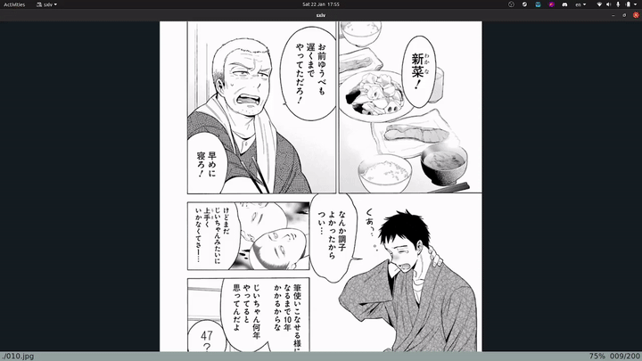

# flameshot-ocr

`flameshot-ocr` is an open source tool to quickly OCR and look up
text. It will look up text in your yomichan search app, so it
respects all dictionaries/frequency lists etc. that you already have
installed. Fast, lightweight, and uses industry-leading OCR software
(`tesseract`).

## Installation
### Linux
1. Clone the repo: `git clone https://github.com/christofferaakre/flameshot-ocr.git`
2. Install dependencies either using the provided `install.sh` script
or manually
3. Add the `flameshot-ocr` script to your path, for example by
executing the following commands:
    1. `cd flameshot-ocr`
    2. `sudo ln -s ~/bin/flameshot-ocr flameshot-ocr`
    2. `sudo ln -s ~/bin/yomichan-search yomichan-search`
4. Make sure that you have Yomichan Search set up as  Chrome/chromium app (not just extension)
5. Make sure that you have `Clipboard monitor` turned on in Yomichan Search.
6. Modify the line in the `yomichan-search` script that reads 
    `/opt/google/chrome/google-chrome --profile-directory=Default --app-id=dmlhnpobnomcmidkoijomppdlpfkedmi`:
    1. Replace the path to `google-chrome` with the path to your chromium browser if you don't use Google Chrome
    2. Replace the app-id with the app-id for your yomichan search app.
7. Replace the hardoded line `/home/negosaki/bin/yomichan-search` with the absolute
path to the `yomichan-search`, which should be `/home/yourUsername/yomichan-search`
if you followed the instructions above. This path needs to be absolute, not relative
    as otherwise it breaks for ubuntu keyboard shortcuts.

#### Install dependencies using install script:
Note that the install script by default installs
tesseract dependencies specific to japanese; if you
want to use `flameshot-ocr` for a different language, you
will need to change the `tesseract-ocr-jpn` and `tesseract-ocr-jpn-vert`
packages to the correct ones for your target language, or
install these dependencies yourself.
1. `cd flameshot-ocr`
2. `chmod +x install.sh`
3. `sudo ./install.sh`
#### Install dependencies manually:
Install the following dependencies in any way you see fit:
* `tesseract` and the required language-specific tesseract packages (`tesseract` need to be in your system path)
* `flameshot` (needs to be in system path)
* `xclip` (needs to be in system path)
* `xdotool` (needs to be in system path)
### MacOS
No support currently
### Windows
No suport for running natively on windows currently,
but you can install [WSL (Windows Subsystem for Linux)](https://docs.microsoft.com/en-us/windows/wsl/install)
and install/run the script from there. So, install WSL and then
refer to the Linux installation instructions.
## Why no Windows/MacOS support?
Currently this project is only supported on Linux. The dependencies used are:
* `flameshot` (Windows/MacOS/Linux support)
* `tesseract` (Windows/MacOS/Linux support)
* `xclip` (Only Linux suport as far as I am aware)
* `xdotool` (Only Linux support as far as I am aware)

`xclip` and `xdotool` are used in pretty simple ways so could
easily be swapped out for Windows/MacOS compatible alternatives.
Also, unix specific paths like `/usr/bin` and `/tmp` are used,
and these do not exist on Windows (although they do on MacOS). However,
this is not too hard to fix, the main problem is not all the dependencies are
supported on Windows/MacOS.

I am not familiar with Windows/MacOS, but if someone else
wants to open a pull request and merge in Windows/MacOS compatible versions,
I'll happily accept the pull request.
## Usage
Run the script like this:
`./flameshot-ocr [language]`. For example, if you are
learning Japanese, you can bind the following two commands
to two separate keyboard shortcuts:
* `flameshot-ocr jpn`
* `flameshot-ocr jpn_vert`

For example, I have the first command mapped to `Alt + z` and the second
to `Alt + x`. So if I am reading a manga and want to look something up, I
simply do the following:
1. Press `Alt + x`
2. Crop my region of choice
3. Done! Yomichan search will automatically pop up with the text
already searched.
